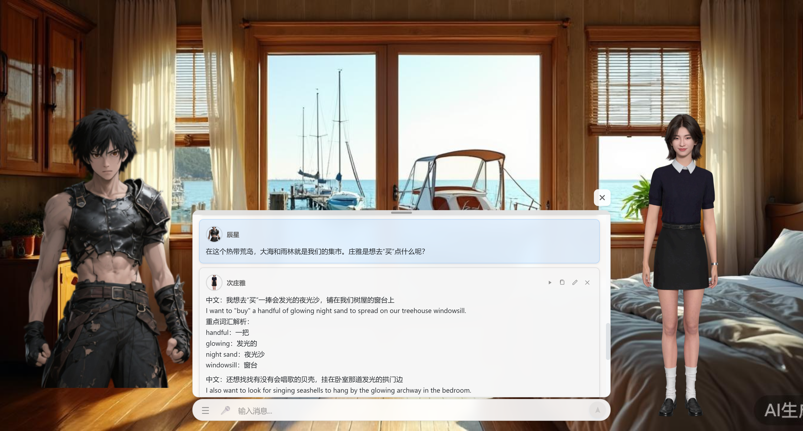

# AI伴侣小世界

一个基于魔珐星云SDK构建的智能虚拟人交互应用，集成了数字人/立绘角色管理、语音识别、大语言模型对话、文本转语音等完整功能，提供沉浸式的AI交互体验。




## 📋 功能特性

### 🎭 角色系统
- **双角色体系**：支持用户角色和伙伴角色，互不干扰
- **角色类型**：支持数字人和立绘两种角色类型
- **角色管理**：完整的创建、编辑、删除、切换功能
- **角色配置**：支持头像、位置、缩放、语音等个性化配置
- **数字人显示限制**：数字人只支持显示一个（可以是用户角色或伙伴角色）

### 🤖 AI对话
- **多模型支持**：支持 DeepSeek、豆包等大语言模型
- **对话模式**：AI对话模式（默认）和演示对话模式（演讲模式）
- **对话历史**：完整的对话历史记录和管理
- **记忆系统**：集成仿生记忆系统，支持多轮对话和上下文理解

### 🎤 语音功能
- **语音识别（ASR）**：集成腾讯云ASR实现实时语音转文字
- **文本转语音（TTS）**：支持豆包TTS，多种音色可选
- **数字人语音**：数字人角色支持使用SDK自带语音或TTS语音
- **语音控制**：支持语音播放、自动播放、自动切换等控制选项

### 🎨 界面功能
- **背景管理**：支持自定义背景图片
- **拖拽功能**：支持数字人和立绘的拖拽定位
- **字幕显示**：实时显示语音识别结果和AI回复
 

## 🚀 快速开始

### 环境要求

- **Node.js**: >= 16.0.0
- **包管理器**: npm 或 pnpm（推荐）

### 安装步骤

1. **克隆项目**
```bash
git clone https://github.com/caoyc/AISmallWorld.git
cd AISmallWorld
```

2. **安装依赖**
```bash
npm install
# 或使用 pnpm
pnpm install
```

3. **启动后端服务**
```bash
npm run server
# 后端服务运行在 http://localhost:3001
```

4. **启动前端开发服务器**
```bash
npm run dev
# 前端服务运行在 http://localhost:5173
```

5. **访问应用**

在浏览器中打开 `http://localhost:5173`

### 构建生产版本

```bash
npm run build
```

构建完成后，使用 `npm run preview` 预览构建结果。

## ⚙️ 配置说明

### 1. API Key 登录

首次使用需要配置 API Key：
- 在菜单中点击"APIKey登录"
- 输入你的 API Key（用于标识用户身份）
- 登录后可以创建和管理用户角色

### 2. 大语言模型配置

在"TTS/ASR设置"中配置：
- **Base URL**: 大模型API的对应的基础URL（例如AI伴侣小世界：`http://36.134.38.44:9000/v1`）
- **模型名称**: 使用的模型名称（例如：`deepseek-chat`）
- **API Key**: 大模型API的访问密钥

### 3. 数字人配置

创建数字人角色时需要配置：
- **App ID**: 魔珐星云SDK的应用ID（[获取APP ID和Secret](https://c.c1nd.cn/9C9WW)）
- **App Secret**: 魔珐星云SDK的应用密钥（[获取APP ID和Secret](https://c.c1nd.cn/9C9WW)）
- **图片URL**: 数字人的图片资源URL

> 💡 获取魔珐数字人邀请码：在菜单中点击"获取魔珐数字人邀请码"，扫描二维码添加微信好友获取。

### 4. 语音识别配置（ASR）

在"TTS/ASR设置"中配置：
- **ASR App ID**: 腾讯云语音识别应用ID
- **ASR Secret ID**: 腾讯云访问密钥ID
- **ASR Secret Key**: 腾讯云访问密钥

### 5. TTS配置

在"TTS/ASR设置"中配置：
- **TTS引擎**: 当前支持豆包TTS
- **音色选择**: 选择喜欢的音色
- **语速/音量**: 调整TTS的语速和音量

## 🎯 使用指南

### 基本流程

1. **登录**
   - 点击菜单中的"APIKey登录"
   - 输入API Key完成登录

2. **创建角色**
   - 点击"用户角色管理"或"伙伴角色管理"
   - 点击"新增角色"
   - 选择角色类型（数字人/立绘）
   - 填写角色信息并保存

3. **连接数字人**
   - 在角色列表中点击"连接"按钮
   - 等待数字人初始化完成
   - 连接成功后数字人会显示在页面上

4. **开始对话**
   - 在输入框中输入消息
   - 点击"发送"或按回车键
   - AI会回复并播放语音

5. **语音输入**
   - 点击麦克风图标
   - 开始说话，系统会自动识别
   - 识别完成后自动发送

### 对话模式

#### AI对话模式（默认）
- 输入消息后调用大语言模型
- AI回复后自动播放语音
- 支持多轮对话和上下文理解

#### 演示对话模式（演讲模式）
- 不调用大语言模型
- 手动选择说话者（用户角色/伙伴角色）
- 直接输入内容并播放语音
- 适合演示和测试场景

### 角色管理

#### 用户角色
- 每个API Key可以创建多个用户角色
- 用户角色用于在对话中代表用户
- 支持设置当前用户角色

#### 伙伴角色
- 全局共享的伙伴角色列表
- 伙伴角色用于在对话中代表AI
- 支持设置当前伙伴角色

### 语音播放控制

在角色编辑面板中可以配置：
- **启用语音播放**：控制是否允许播放该角色的语音
- **自动播放**：新消息是否自动播放语音
- **自动切换**：是否根据说话者自动切换角色显示

## 🏗️ 项目结构

```
AISmallWorld/
├── src/                          # 前端源码
│   ├── components/              # Vue组件
│   │   ├── AvatarRender.vue     # 角色渲染组件
│   │   └── ConfigPanel.vue      # 配置面板组件
│   ├── services/                # 服务层
│   │   ├── avatar.ts           # 数字人SDK服务
│   │   ├── llm.ts              # 大语言模型服务
│   │   ├── tts.ts              # TTS服务
│   │   ├── chatHistory.ts      # 对话历史服务
│   │   ├── roleManagement.ts   # 伙伴角色管理
│   │   └── userRoleManagement.ts # 用户角色管理
│   ├── renderers/               # 渲染器
│   │   ├── base/               # 基础渲染器接口
│   │   └── digital-human/      # 数字人渲染器
│   ├── stores/                  # 状态管理
│   │   └── app.ts              # 应用状态
│   ├── types/                   # TypeScript类型定义
│   ├── constants/               # 常量定义
│   └── utils/                   # 工具函数
├── server/                       # 后端服务
│   ├── index.js                 # Express服务器
│   └── db.js                    # 数据库操作
├── docs/                         # 文档
├── uploads/                      # 上传文件目录
│   ├── avatars/                 # 头像文件
│   └── backgrounds/             # 背景文件
└── data/                         # 数据目录
    └── chat_history.db          # SQLite数据库
```

## 🔧 技术栈

### 前端
- **框架**: Vue 3 (Composition API)
- **语言**: TypeScript
- **构建工具**: Vite
- **UI库**: 原生CSS

### 后端
- **框架**: Express.js
- **数据库**: SQLite (better-sqlite3)
- **文件上传**: Multer

### 核心依赖
- **数字人SDK**: XmovAvatar (魔珐星云)
- **语音识别**: 腾讯云ASR
- **大语言模型**: DeepSeek API / 豆包API
- **TTS**: 豆包TTS

## 📦 核心功能

### 角色渲染系统

支持两种角色类型的渲染：
- **数字人**: 基于XmovAvatar SDK的3D虚拟人渲染
- **立绘**: 基于图片的2D角色渲染

两种角色类型共享相同的渲染接口，支持：
- 位置控制（拖拽定位）
- 缩放控制
- 显示/隐藏切换
- 语音播放

### 对话系统

- **消息管理**: 完整的消息增删改查
- **历史记录**: 持久化存储对话历史
- **多租户支持**: 基于API Key的用户隔离
- **流式响应**: 支持大语言模型的流式输出

### 状态管理

- **精确更新**: 内存状态像数据库一样维护，精确到字段级别
- **角色状态**: 每个角色的连接状态、显示状态独立管理
- **响应式更新**: 基于Vue 3的响应式系统

## 🔑 关键组件

### ConfigPanel (配置面板)
`src/components/ConfigPanel.vue`
- 角色管理（创建、编辑、删除、切换）
- API配置（LLM、ASR、TTS）
- 对话输入和发送
- 菜单系统

### AvatarRender (角色渲染)
`src/components/AvatarRender.vue`
- 数字人和立绘的渲染
- 拖拽功能
- 字幕显示
- 历史面板

### DigitalHumanRenderer (数字人渲染器)
`src/renderers/digital-human/DigitalHumanRenderer.ts`
- 数字人SDK的封装
- 连接管理
- 事件处理

## 📝 数据库结构

### 角色表 (roles)
- 伙伴角色的完整信息
- 包括配置、位置、语音等所有属性

### 用户角色表 (user_roles)
- 用户角色的完整信息
- 关联到API Key

### 对话历史表 (chat_messages)
- 消息ID、用户ID、角色、内容、时间戳

### 背景表 (backgrounds)
- 背景图片的URL和配置

## 🌍 高级功能

### BoinicWorld 游戏世界指令系统

支持通过指令操作游戏世界，详见 [游戏世界指令系统文档](docs/游戏世界指令系统.md)

### 仿生记忆系统

集成仿生记忆系统，支持：
- 长短期记忆机制
- 智能遗忘机制
- 记忆检索与激活
- 多租户安全隔离

详见 [仿生记忆系统文档](docs/仿生记忆系统.md)

## 🐛 常见问题

### 1. 数字人连接失败
- 检查App ID和App Secret是否正确
- 确认网络连接正常
- 查看浏览器控制台的错误信息

### 2. 语音识别不工作
- 检查浏览器麦克风权限
- 确认ASR配置信息正确
- 检查网络连接

### 3. 对话历史丢失
- 确认后端服务正在运行
- 检查数据库文件是否存在
- 查看后端日志

### 4. 角色显示异常
- 刷新页面重新加载
- 检查角色配置是否完整
- 确认角色类型设置正确

## 📄 许可证

本项目采用 [MIT License](LICENSE) 许可证。

## 🤝 贡献

欢迎提交 Issue 和 Pull Request！

## 📞 联系方式

- **技术交流群**: 扫描二维码加入
  

---

**AI伴侣小世界** - 让AI交互更自然、更智能
