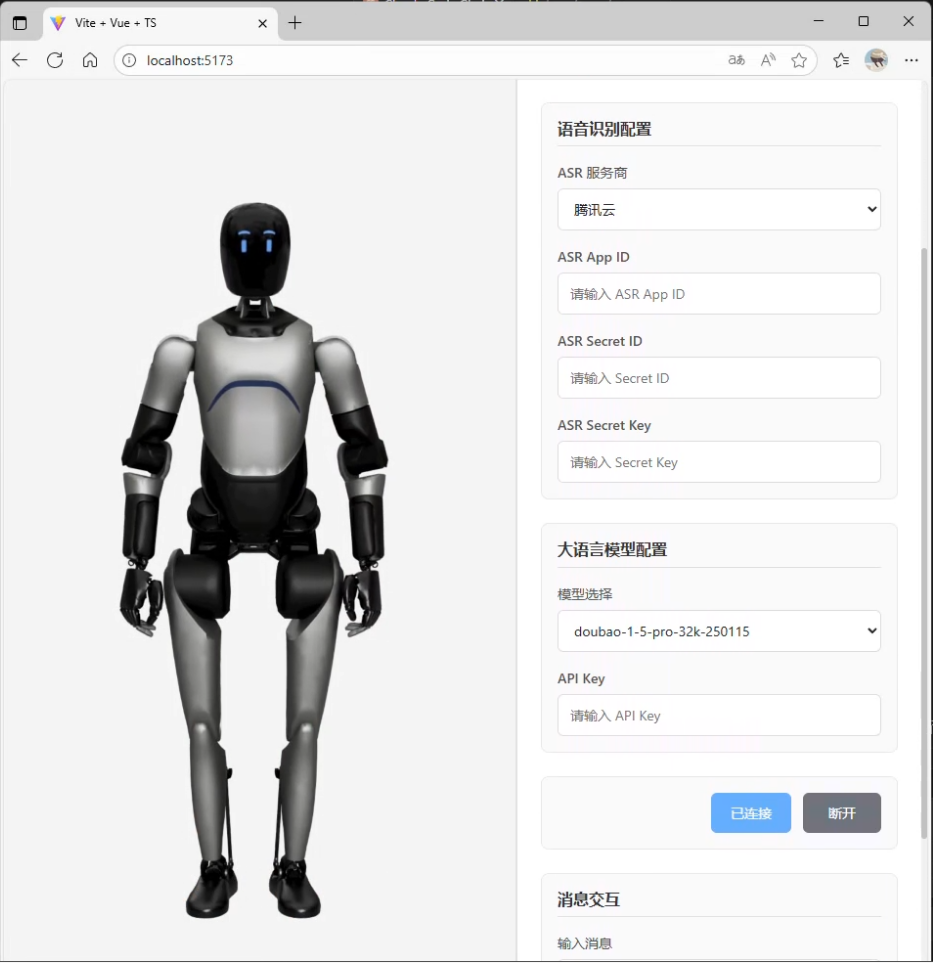

# XmovAvatarSDK

这是一个基于魔珐星云sdk构建的智能虚拟人交互演示应用，集成了语音识别、大语言模型和虚拟人SDK，提供完整的语音交互体验。



## 📋 功能特性

- **🎭 虚拟人渲染**: 基于 XmovAvatar SDK 的3D虚拟人渲染
- **🎤 语音识别**: 集成腾讯云ASR实现实时语音转文字
- **🤖 AI对话**: 支持豆包大模型进行智能对话
- **💬 字幕显示**: 实时显示语音识别结果和AI回复
- **🎙️ 语音输入**: 支持语音输入和文本输入两种交互方式
- **⚙️ 配置管理**: 灵活的配置界面，支持多种API配置

## 技术交流群(邀请码获取)


## 🏗️ 项目结构

```
src/
├── App.vue                    # 应用主组件
├── main.ts                    # 应用入口
├── style.css                  # 全局样式
├── vite-env.d.ts             # Vite环境类型声明
├── components/                # Vue组件
│   ├── AvatarRender.vue      # 虚拟人渲染组件
│   └── ConfigPanel.vue       # 配置面板组件
├── stores/                    # 状态管理
│   ├── app.ts                # 应用状态和业务逻辑
│   └── sdk-test.html         # SDK测试页面
├── services/                  # 服务层
│   ├── avatar.ts             # 虚拟人SDK服务
│   └── llm.ts                # 大语言模型服务
├── composables/               # Vue组合式函数
│   └── useAsr.ts             # 语音识别Hook
├── types/                     # TypeScript类型定义
│   └── index.ts              # 统一类型导出
├── constants/                 # 常量定义
│   └── index.ts              # 应用常量
├── utils/                     # 工具函数
│   ├── index.ts              # 通用工具函数
│   └── sdk-loader.ts         # SDK加载器
├── lib/                       # 第三方库封装
│   └── asr.ts                # 语音识别底层服务
└── assets/                    # 静态资源
    ├── siri.png              # 语音识别动画图标
    └── vue.svg               # Vue Logo
```

## 🚀 快速开始

### 环境要求

- Node.js >= 16
- pnpm (推荐)

### 安装依赖

```bash
pnpm install
```

### 开发环境运行

```bash
pnpm run dev
```

### 构建生产版本

```bash
pnpm run build
```

### 预览构建结果

```bash
pnpm run preview
```

## ⚙️ 配置说明

在使用本应用前，需要配置以下参数：

### 1. 虚拟人SDK配置([魔珐星云](https://c.c1nd.cn/9C9WW))
- **应用APP ID**: XmovAvatar SDK的应用ID
- **应用APP Secret**: XmovAvatar SDK的应用密钥

### 2. 语音识别配置（[腾讯云ASR](https://cloud.tencent.com/product/asr?Is=sdk-topnav)）
- **ASR App ID**: 腾讯云语音识别应用ID
- **ASR Secret ID**: 腾讯云访问密钥ID
- **ASR Secret Key**: 腾讯云访问密钥

### 3. 大语言模型配置
- **大模型**: 当前支持 `deepseek-chat`（默认）、`doubao-1-5-pro-32k-250115`
- **大模型Key**: 对应API的访问密钥（默认已预填 DeepSeek API Key，可点击眼睛图标切换显示/隐藏）

## 🎯 使用指南

1. **配置参数**: 在右侧配置面板中填入所需的API配置信息
2. **建立连接**: 点击"连接"按钮初始化虚拟人SDK
3. **文本交互**: 在文本框中输入内容，点击"发送"进行对话
4. **语音交互**: 点击"语音输入"按钮进行语音对话
5. **查看回复**: 虚拟人会播报AI回复，同时显示字幕

## 🔧 技术栈

- **前端框架**: Vue 3 (Composition API)
- **开发语言**: TypeScript
- **构建工具**: Vite
- **虚拟人SDK**: XmovAvatar
- **语音识别**: 腾讯云ASR
- **大语言模型**: DeepSeek API (基于OpenAI兼容接口，默认)，支持豆包等其他兼容接口

## 📦 核心依赖

```json
{
  "vue": "3.5.18",
  "openai": "5.12.2",
  "typescript": "~5.8.3",
  "vite": "7.1.2",
  "@vitejs/plugin-vue": "6.0.1",
  "vue-tsc": "3.0.5"
}
```

## 🎨 界面说明

### 主界面布局
- **左侧**: 虚拟人渲染区域，显示3D虚拟人和字幕
- **右侧**: 配置和控制面板

### 交互元素
- **字幕区域**: 显示语音识别结果和AI回复
- **语音动画**: 语音输入时显示Siri风格动画
- **加载状态**: 连接建立前显示加载提示

## 🔥 核心功能实现

### 虚拟人渲染
```typescript
// 连接虚拟人SDK
const avatar = await avatarService.connect(appId, appSecret, subtitleCallback, closeCallback)
```

### 语音识别
```typescript
// 使用语音识别Hook
const { start, stop, asrText } = useAsr(config, vadTime)
```

### AI对话
```typescript
// 发送消息到大语言模型
const answer = await llmService.send(model, text)
```

## 🔑 关键组件介绍

### Store (状态管理)
`src/stores/app.ts` - 全局状态管理中心
- **功能**: 管理应用状态、SDK连接、配置信息
- **核心方法**:
  - `connect()`: 建立虚拟人SDK连接
  - `destroy()`: 断开连接并清理资源
  - `sendToLLM()`: 发送消息到大语言模型
- **状态属性**: appId、appSecret、llmKey、connected等

### AvatarRender (虚拟人渲染组件)
`src/components/AvatarRender.vue` - 虚拟人展示组件
- **功能**: 渲染3D虚拟人、显示字幕、语音动画
- **特性**:
  - 动态容器ID生成
  - 字幕实时显示
  - 语音输入状态指示
  - 连接状态管理

### ConfigPanel (配置面板组件)
`src/components/ConfigPanel.vue` - 配置和控制面板
- **功能**: API配置、连接控制、文本输入、语音输入
- **配置项**:
  - 虚拟人SDK配置 (appId、appSecret)
  - ASR配置 (腾讯云相关参数)
  - 大模型配置 (模型选择、API密钥)
- **操作按钮**: 连接/断开、语音输入、发送消息

### AvatarService (虚拟人SDK服务)
`src/services/avatar.ts` - XmovAvatar SDK封装
- **功能**: 
  - SDK初始化和连接管理
  - 事件回调处理 (字幕、状态变化)
  - 错误处理和重连机制
- **核心特性**:
  - 随机容器ID生成
  - 状态监听 (speak、think等)
  - 字幕事件处理

### LLM服务 (大语言模型)
`src/services/llm.ts` - 大语言模型服务封装
- **功能**: 
  - OpenAI兼容API调用
  - 支持流式和非流式响应
  - 豆包API集成
- **配置**: 
  - 基础URL: `https://ark.cn-beijing.volces.com/api/v3`
  - 支持模型: `doubao-1-5-pro-32k-250115`

### ASR Hook (语音识别)
`src/composables/useAsr.ts` - 语音识别复用逻辑
- **功能**:
  - 腾讯云ASR集成
  - 语音识别生命周期管理
  - VAD (语音活动检测) 配置
- **事件处理**:
  - 识别开始/结束
  - 实时识别结果
  - 错误处理

### 工具函数
- `src/utils/index.ts`: 通用工具函数集合
- `src/utils/sdk-loader.ts`: SDK动态加载器
- `src/lib/asr.ts`: 腾讯云ASR签名和配置

## 📝 注意事项

1. **API配置**: 确保所有API配置信息正确填写
2. **网络连接**: 需要稳定的网络连接以确保SDK和API正常工作
3. **浏览器兼容**: 建议使用现代浏览器以获得最佳体验
4. **麦克风权限**: 语音功能需要浏览器麦克风权限

## 🌐 相关项目

### Web Director (网页导办)
`apps/web-director/` - 网页导办演示项目
- **功能**: 提供网页导办服务的交互界面
- **特性**:
  - 响应式设计，适配不同屏幕尺寸
  - 支持麦克风权限的 iframe 嵌入
  - 一键展开/收起交互体验
- **技术**: 纯 HTML + CSS + JavaScript
- **访问**: 通过 HTTP 服务器访问 `http://localhost:8000/demo.html`

<<<<<<< HEAD
## 🌍 BoinicWorld 游戏世界指令系统

AISmallWorld 集成了 BoinicWorld 智能游戏世界系统，支持通过指令操作游戏世界。目前支持**正常对话模式**和**强指令模式（! 开头）**。

### 正常对话模式

**说明**：直接输入文字，与AI进行正常对话，无需任何特殊前缀。

**使用方式**：
在对话输入框中直接输入文字，然后点击"发送"按钮。系统会将消息发送到 BoinicWorld 进行处理，AI会以角色身份回复你的对话。

**特点**：
- ✅ 支持多轮对话
- ✅ 自动记忆对话内容（仿生记忆系统）
- ✅ 适合日常交流和咨询

**注意事项**：
- 正常对话会触发仿生记忆系统，AI会记住你们的对话内容
- 对话内容会被用于构建AI的人格背景和记忆
- 支持多轮连续对话，AI会基于之前的对话内容进行回复

### 强指令模式（! 开头）

**说明**：使用 `!` 开头，直接执行游戏指令，速度最快。

**语法**：`!指令名称 参数`

**特点**：
- ✅ 执行速度快
- ✅ 直接调用游戏指令
- ✅ 适合熟悉指令的用户

**支持的指令前缀**：
- `!`（半角感叹号）
- `！`（全角感叹号）

**使用方式**：
在对话输入框中输入以 `!` 开头的指令，然后点击"发送"按钮。系统会将指令发送到 BoinicWorld 进行处理。

**示例**：
```
!look
!create name=温馨家园 desc="一个温馨舒适的居住区域"
!visit name=温馨家园
!room create name=客厅 desc="住宅区的主要活动空间"
```

### 层级概念说明

游戏世界采用四层结构，每层有不同的功能和可用的指令：

#### World层（荒野层）

**概念**：最外层，代表整个游戏世界的坐标系统。

**功能**：
- 创建和管理区域（Region）
- 在世界坐标中移动

**支持的指令**：`create`、`delete`、`look`、`visit`、`goto`、`north`、`south`、`east`、`west`、`northeast`、`northwest`、`southeast`、`southwest`、`up`、`down`

**指令示例**：
```
!look                                    # 查看当前位置
!create name=温馨家园 desc="一个温馨舒适的居住区域"  # 创建区域
!visit name=温馨家园                     # 进入区域
!goto 100,200                           # 前往坐标
!north                                  # 向北走
```

#### Region层（区域层）

**概念**：区域层，代表一个具体的区域，包含多个场所。

**功能**：
- 创建和管理场所（Place）
- 更新区域描述和图像
- 在区域内移动

**支持的指令**：`create`、`update`、`delete`、`look`、`visit`、`return`、`goto`、`north`、`south`、`east`、`west`、`northeast`、`northwest`、`southeast`、`southwest`、`up`、`down`

**指令示例**：
```
!create name=住宅区 desc="温馨家园的主要居住区域"  # 创建场所
!update desc="温馨家园是一个温馨舒适的居住区域"    # 更新区域描述
!look                                    # 查看当前区域
!list                                    # 列出所有场所
!return                                  # 返回荒野层
!visit name=住宅区                       # 进入场所
!north                                   # 向北走
```

#### Place层（场所层）

**概念**：场所层，代表区域内的一个具体场所，包含多个房间。

**功能**：
- 创建和管理房间（Room）
- 创建物品、出口、NPC等对象
- 更新场所描述和图像

**支持的指令**：`create`、`update`、`delete`、`look`、`visit`、`return`、`room`、`exit`、`npc`、`item`、`monster`、`animal`、`plant`

**指令示例**：
```
!room create name=客厅 desc="住宅区的主要活动空间"  # 创建房间
!room list                                # 列出所有房间
!room look name=客厅                      # 查看房间
!item create name=沙发 desc="客厅的主要家具"  # 创建物品
!item list                                # 列出所有物品
!exit create name=卧室门 to=卧室 desc="从客厅通往卧室的门"  # 创建出口
!exit list                                # 列出所有出口
!npc create name=店小二 desc="负责接待的店小二"  # 创建NPC
!npc list                                 # 列出所有NPC
!return                                   # 返回区域层
```

#### Room层（房间层）

**概念**：房间层，代表场所内的一个具体房间，是最细粒度的空间单位。

**功能**：
- 创建和管理物品（item）
- 创建和管理出口（exit）
- 创建和管理NPC、怪物、动物、植物
- 物品交互（获取、丢弃等）
- 通过出口移动到其他房间

**支持的指令**：`look`、`return`、`item`、`exit`、`npc`、`monster`、`animal`、`plant`、`update`、`go`、`north`、`south`、`east`、`west`、`northeast`、`northwest`、`southeast`、`southwest`、`up`、`down`

**指令示例**：
```
!look                                    # 查看当前房间
!update desc="更新后的房间描述"            # 更新房间描述
!return                                  # 返回场所层
!item create name=沙发 desc="客厅的主要家具"  # 创建物品
!item get name=沙发                      # 拿起物品
!item drop name=沙发                    # 放下物品
!item list                               # 列出所有物品
!exit create name=卧室门 to=卧室 desc="从客厅通往卧室的门"  # 创建出口
!go name=卧室门                          # 通过出口移动
!exit list                               # 列出所有出口
!npc create name=店小二 desc="负责接待的店小二"  # 创建NPC
!npc look name=店小二                    # 查看NPC
!npc list                                # 列出所有NPC
```

### 层级关系图

```
World层（荒野层）
  └── Region层（区域层）
       └── Place层（场所层）
            └── Room层（房间层）
```

**层级进入**：使用 `visit` 指令进入下一层
- World层 → Region层：`!visit name=区域名`
- Region层 → Place层：`!visit name=场所名`
- Place层 → Room层：`!visit name=房间名`

**层级返回**：使用 `return` 指令返回上一层
- Room层 → Place层：`!return`
- Place层 → Region层：`!return`
- Region层 → World层：`!return`

**层级移动顺序**：
- **进入**：World → Region → Place → Room（使用 `visit` 指令）
- **返回**：Room → Place → Region → World（使用 `return` 指令）

### 指令参数格式

强指令模式需要严格按照指令语法格式，参数使用 `name=值` 的形式：

**正确示例**：
```
!create name=温馨家园 desc="一个温馨舒适的居住区域"
!visit name=温馨家园
!room create name=客厅 desc="住宅区的主要活动空间"
!item create name=沙发 desc="客厅的主要家具"
```

**注意事项**：
- 参数名和值之间使用 `=` 连接
- 如果值包含空格，需要用引号包裹（如 `desc="描述内容"`）
- 多个参数之间用空格分隔

### 快速参考

| 操作 | 强指令（!） |
|------|------------|
| 查看位置 | `!look` |
| 创建区域 | `!create name=区域名 desc="描述"` |
| 进入区域 | `!visit name=区域名` |
| 创建场所 | `!create name=场所名 desc="描述"` |
| 创建房间 | `!room create name=房间名 desc="描述"` |
| 创建物品 | `!item create name=物品名 desc="描述"` |
| 创建出口 | `!exit create name=出口名 to=目标 desc="描述"` |
| 创建NPC | `!npc create name=NPC名 desc="描述"` |
| 返回上一层 | `!return` |
| 通过出口 | `!go name=出口名` |

### 📚 开发示例

想要了解如何完整地构建一个游戏世界？可以参考以下示例文档：

**[晨昏雨林 - 指令转换文档](示例文档：晨昏雨林.md)**

这是一个完整的游戏世界开发示例，展示了如何从零开始构建一个完整的游戏场景：

- **完整的层级结构**：从区域层到房间层的完整构建流程
- **详细的指令示例**：包含所有创建、移动、交互指令的实际应用
- **场景描述**：展示了如何编写生动的场景描述
- **物品和出口**：完整的物品创建和出口连接示例
- **可直接执行**：所有指令都可以直接复制到对话框中执行

该示例文档包含：
- 区域层：创建"晨昏雨林"区域
- 场所层：创建"晚晴茶馆"、"青藤小筑"、"藤悬蔓廊"等场所
- 房间层：创建各个场所内的房间
- 物品层：创建各类物品和装饰
- 出口层：连接各个房间的出口

通过这个示例，你可以学习到：
1. 如何规划游戏世界的层级结构
2. 如何编写吸引人的场景描述
3. 如何创建和连接游戏对象
4. 如何组织指令的执行顺序

## 🧠 仿生记忆系统

AISmallWorld 集成了 BoinicWorld 的仿生记忆系统（BionicMemory），为AI提供智能记忆管理能力。

### 什么是仿生记忆系统？

仿生记忆系统是一个基于仿生学原理的AI记忆管理系统，模拟人类大脑的长短期记忆机制，让AI能够记住与你的对话内容，并在后续对话中自然地引用这些记忆。

### 核心特性

#### 1. 长短期记忆机制

- **短期记忆**：保存最近的对话内容，用于当前对话的上下文理解
- **长期记忆**：将重要信息转化为长期记忆，永久保存
- **自动转换**：系统会自动判断哪些内容需要转为长期记忆

#### 2. 智能遗忘机制

- **用进废退**：基于牛顿冷却定律的遗忘算法
- **自然遗忘**：不常用的记忆会逐渐淡化，但不会完全消失
- **重要记忆保护**：重要的个性化内容会被保护，避免丢失

#### 3. 记忆检索与激活

- **智能检索**：根据当前对话内容，自动检索相关的历史记忆
- **上下文关联**：将相关记忆激活并注入到对话上下文中
- **个性化回复**：AI会基于你的历史对话习惯和偏好进行回复

#### 4. 多租户安全隔离

- **用户隔离**：每个用户的记忆完全独立，互不干扰
- **数据安全**：所有记忆数据存储在本地，完全掌控
- **隐私保护**：严格的数据访问控制

### 工作原理

1. **对话记录**：每次对话都会被记录到记忆系统中
2. **内容分析**：系统分析对话内容的重要性和相关性
3. **记忆存储**：重要内容转为长期记忆，普通内容作为短期记忆
4. **记忆检索**：在后续对话中，系统自动检索相关记忆
5. **上下文注入**：将检索到的记忆注入到对话上下文中
6. **个性化回复**：AI基于记忆和当前对话生成个性化回复

### 使用场景

- **多轮对话**：支持连续多轮对话，AI会记住之前的内容
- **个性化交流**：AI会记住你的偏好、习惯和特点
- **上下文理解**：AI能够理解对话的上下文和历史背景
- **情感记忆**：AI会记住你们之间的情感互动和重要时刻

### 注意事项

1. **记忆持久化**：你的对话内容会被永久保存（除非手动清理）
2. **隐私保护**：所有记忆数据仅用于改善对话体验，不会泄露
3. **记忆管理**：系统会自动管理记忆，重要内容会被优先保留
4. **个性化构建**：通过长期对话，AI会逐渐构建出你的人格背景

### 技术特点

- **本地Embedding**：使用本地Qwen3-Embedding-0.6B模型，无需外部API
- **向量数据库**：基于ChromaDB的高效向量检索
- **异步处理**：记忆处理不阻塞对话响应，保证流畅体验
- **智能摘要**：自动压缩长文本内容，提高存储效率

## 📄 许可证

本项目仅供学习和演示使用。 
=======
## 📄 许可证

本项目仅供学习和演示使用。"# AISmallWorld" 
>>>>>>> 88447e514857185c85da7de07f9a2631aaab6705
